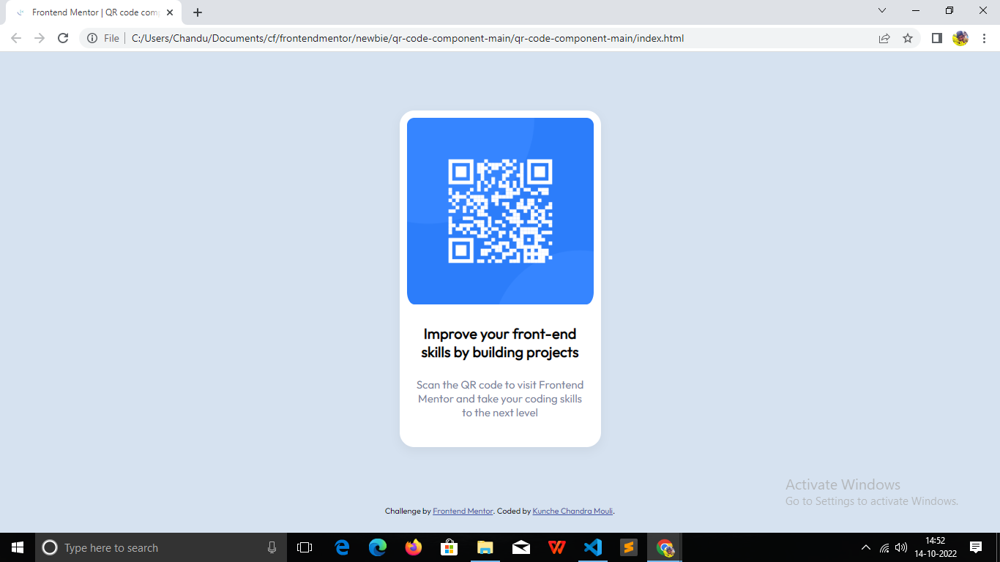

# Frontend Mentor - QR code component solution

This is a solution to the https://www.frontendmentor.io/challenges/qr-code-component-iux_sIO_H . Frontend Mentor challenges help you improve your coding skills by building realistic projects. 

## Table of contents

- overview
  - screenshot
  - links
- my-process
  - built-with
  - what-i-learned
  - continued-development

## Overview

### Screenshot

### Links

- Solution URL: https://github.com/chanduKunche/QR-code-component-.git
- Live Site URL: https://chandukunche.github.io/QR-code-component-/

## My process

### Built with

- Semantic HTML5 markup
- CSS custom properties

### What I learned

I learnt how to design a UI card component using HTML5 and CSS. 

### Continued development

I still need to learn Flexboxes in CSS. The above card can also be built with Flexbox and Grid properties in CSS. But I need to learn them and can use in my future projects.

## Author

- Frontend Mentor - https://www.frontendmentor.io/profile/chanduKunche

